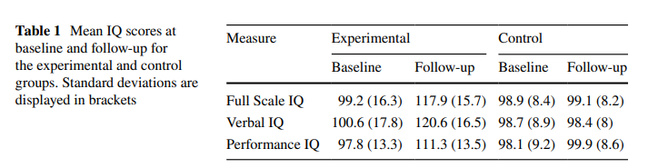
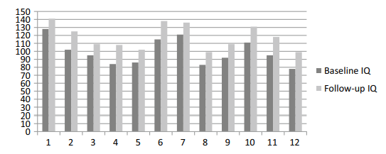
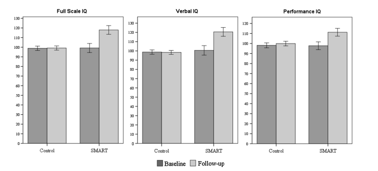
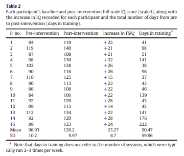
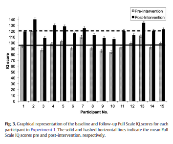
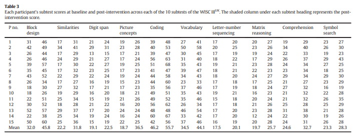
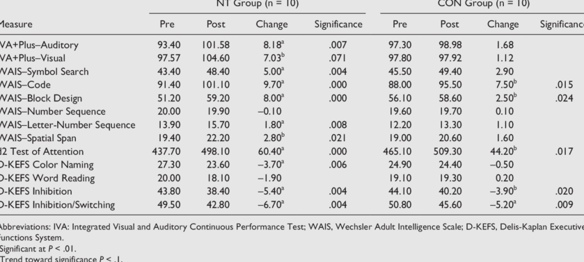

# Brain Endurance Training Improves Soccer-Specific Technical Skills and Cognitive Performance in Fatigued Professional Soccer Players

Sample size: 31
Control group: passive

Those who did brain endurance training saw improvements in soccer skills and alertness. Those who didn't train saw no such improvements.

https://www.researchgate.net/publication/383385014_Brain_Endurance_Training_Improves_Soccer-Specific_Technical_Skills_and_Cognitive_Performance_in_Fatigued_Professional_Soccer_Players

# Combined Cognitive and Exercise Training Enhances Muscular Strength and Endurance: A Pilot Study

Sample size: 8
Control group: none

Brain endurance training increased strength and endurance and reduced mental fatigue during bench presses, more than typically seen without brain endurance training.

# Brain endurance training improves shot speed and accuracy in grassroots padel players

Sample size: 61
Control group: passive

Those who did brain endurance training were faster and more accurate in a sport compared to those who didn't train.

https://www.researchgate.net/publication/371524246_Brain_endurance_training_improves_shot_speed_and_accuracy_in_grassroots_padel_players

# Concurrent brain endurance training improves endurance exercise performance

Sample size: 36
Control group: passive

Participants who did brain endurance training saw almost three times the improvement in endurance of those who didn't train.

https://www.researchgate.net/publication/347329716_Concurrent_brain_endurance_training_improves_endurance_exercise_performance

# Prior brain endurance training improves endurance exercise performance

Sample size: 24
Control group: passive

Those who did brain endurance training saw double the **improvement in endurance** compared to those who didn't train.

https://onlinelibrary.wiley.com/doi/10.1080/17461391.2022.2153231

# Brain endurance training improves sedentary older adults’ cognitive and physical performance when fresh and fatigued

Sample size: 24
Control group: passive

Those who did brain endurance training saw greater **physical and cognitive performance improvements** than those who didn't train. Improvements persisted even 3 weeks after training stopped.

https://www.researchgate.net/publication/384540072_Brain_endurance_training_improves_sedentary_older_adults'_cognitive_and_physical_performance_when_fresh_and_fatigued

# Brain Endurance Training Improves and Maintains Chest Press and Squat Jump Performance When Fatigued

Sample size: 91
Control group: passive

Participants who did brain endurance training were able to complete more chest presses and squat jumps compared to those who didn't train.

https://pure-oai.bham.ac.uk/ws/portalfiles/portal/223037995/Resistance_BET_Manuscript_-_JSCR_in_press.pdf

# Brain Endurance Training Improves Physical, Cognitive, and Multitasking Performance in Professional Football Players

Sample size: 22
Control group: active listening to neutral sounds

Participants who did brain endurance training saw greater **improvements in endurance and physical speed** compared to those who didn't train.

https://www.researchgate.net/publication/365374393_Brain_Endurance_Training_Improves_Physical_Cognitive_and_Multitasking_Performance_in_Professional_Football_Players

# Brain Endurance Training improves endurance and cognitive performance in road cyclists

Sample size: 28 (Study 1) and 24 (Study 2)
Control group: active listening to neutral sounds

Across two studies, participants who did brain endurance training saw greater improvements in endurance than those who didn't train; in Study 2 they also saw greater improvements in physical performance.

https://www.researchgate.net/publication/370929217_Brain_Endurance_Training_improves_endurance_and_cognitive_performance_in_road_cyclists

# Training semantic long-term memory retrieval transfers to executive function and reading fluency

Sample size: 54
Control group: active non-training Posner task

Training with the Posner task significantly increased reading speed and comprehension and improved long-term memory. There were also electrophysiological improvements. Those who did the non-training task saw no such improvements.

https://pubmed.ncbi.nlm.nih.gov/38556043/

# Working memory training improves emotion regulation ability: Evidence from HRV

Sample size: 40
Control group: passive

Those who did working memory training saw improvements in emotional control. Those who didn't train saw no improvements.

https://www.researchgate.net/publication/286528900_Working_memory_training_improves_emotion_regulation_ability_Evidence_from_HRV

# Digital Distractions in Reading: Investigating Impact of Cognitive Control Training on Reading Behavior and Outcomes

Sample size: 22
Control group: passive

Participants who did cognitive control training saw better reading comprehension and less distraction when reading than those who didn't train.

https://www.researchgate.net/publication/384662683_Digital_Distractions_in_Reading_Investigating_Impact_of_Cognitive_Control_Training_on_Reading_Behavior_and_Outcomes

# Adaptive working memory training can reduce anxiety and depression vulnerability in adolescents

Sample size: 120
Control group: active non-training working memory task

Teenagers who did working memory training saw improvements in anxiety and depression. The improvements remained even after 1 month. Those who did the non-training task saw no such improvements.

https://sci-hub.ru/10.1111/desc.12831

# The effects of adaptive working memory training and mindfulness meditation training on processing efficiency and worry in high worriers

Sample size: 60
Control group: active non-training working memory task

Participants did working memory training and meditation and saw reductions in worry and improvements in attentional control and resilience. Those who did the non-training task saw no such effects.

https://core.ac.uk/reader/80694277

# Working memory training improves emotion regulation in drug abstainers: Evidence from frontal alpha asymmetry

Sample size: 40
Control group: passive

Those who did working memory training saw improvements in emotional control. Those who didn't train saw no improvements.

https://sci-hub.ru/10.1016/j.neulet.2020.135513

# Psychological intervention with working memory training increases basal ganglia volume: A VBM study of inpatient treatment for methamphetamine use

Sample size: 66
Control group: passive

Drug users who did working memory training saw improvements in impulsivity together with neural changes. Those who didn't train saw no such improvements.

https://www.researchgate.net/publication/306927071_Psychological_intervention_with_working_memory_training_increases_basal_ganglia_volume_A_VBM_study_of_inpatient_treatment_for_methamphetamine_use

# Working-memory training in younger and older adults: training gains, transfer, and maintenance

Sample size: 100
Control group: active non-training working memory task

Working memory training **significantly improved attention in daily life for those who trained**. The improvements remained even after 3 months. Those who did the non-training task saw no such improvements.

https://researchgate.net/publication/223982918_Working-memory_training_in_younger_and_older_adults_training_gains_transfer_and_maintenance

# A Controlled Trial of Working Memory Training for Children and Adolescents with ADHD

Sample size: 52
Control group: none

Working memory training **significantly improved attention and reduced ADHD symptoms** after training and 4 months later.

https://sci-hub.ru/10.1080/15374416.2010.517162

# Remember the Future: Working Memory Training Decreases Delay Discounting Among Stimulant Addicts

Sample size: 27
Control group: active non-training working memory tasks

Working memory training **significantly reduced impulsivity in drug addicts**. Those who did the non-training tasks saw no reduction.

https://www.researchgate.net/publication/47519289_Remember_the_Future_Working_Memory_Training_Decreases_Delay_Discounting_Among_Stimulant_Addicts

# Cognitive Priming During Warmup Enhances Sport and Exercise Performance: A Goldilocks Effect

Sample size: **31** (Study 1)
Control group: **none**

Sleep-deprived and rested participants did 17.5-min-long cognitive training sessions (mental warm-ups) before competing in a sport. They saw **significant increases in cognitive performance and sport performance**.

https://pmc.ncbi.nlm.nih.gov/articles/PMC11940224

# Cognitive Priming During Warmup Enhances Sport and Exercise Performance: A Goldilocks Effect

Sample size: 32 (Study 2)
Control group: active physical warm-up group

Sleep-deprived and rested participants did short cognitive training sessions (mental warm-ups) before physical activity. Those who did mental warm-ups saw **significant increases in cognitive performance and physical performance**. Mental warm-ups effectively **nullified the effects of sleep deprivation**. Those who only did physical warm-ups saw much smaller improvements.

https://pmc.ncbi.nlm.nih.gov/articles/PMC11940224

# Cognitive Calisthenics: Pre-lecture Cognitive Exercise Boosts Learning

Sample size: 28 (Experiment 1) and 35 (Experiment 2)
Control group: none

College students **performed better on exams** based on lectures attended right after 5-min cognitive training sessions (mental warm-ups) than without warm-ups. They also reported improved attentiveness during lectures after warm-ups. This was replicated across two experiments.

https://www.researchgate.net/publication/359887670_Cognitive_Calisthenics_Pre-lecture_Cognitive_Exercise_Boosts_Learning

# Cognitive Calisthenics: Pre-lecture Cognitive Exercise Boosts Learning

Sample size: **35** (Experiment 2)
Control group: **none**

College students **performed better on exams** based on lectures attended right after 5-min cognitive training sessions (mental warm-ups) than without warm-ups. They also reported improved attentiveness during lectures after warm-ups.

https://www.researchgate.net/publication/359887670_Cognitive_Calisthenics_Pre-lecture_Cognitive_Exercise_Boosts_Learning

# Cognitive Exercise Boosts Exam Performance in an Introductory Psychology Course

Sample size: 68
Control group: none

68 college students saw **significantly better performance in college exams** based on material that was taught in lectures attended right after cognitive training, compared to material from lectures attended without cognitive training.

https://sci-hub.ru/10.1177/0098628319834196

# Differential effects of physical exercise, cognitive training and mindfulness practice on serum BDNF levels in healthy older adults: a randomized controlled intervention study

Sample size: 146
Control group: active physical exercise, meditation, or non-training working memory task

Those who did working memory training saw **significant increases in serum BDNF levels**. Those who did physical exercise, meditation, or the non-training working memory task saw no increases.

https://pmc.ncbi.nlm.nih.gov/articles/PMC10896591

# BDNF-mediated improvements in cognition after computerized cognitive training

Sample size: 75
Control group: active non-training task

Those who did cognitive training saw **increases in serum BDNF levels**. The BDNF increases correlated with cognitive test gains. Those who did the non-training task saw no changes.

https://alz-journals.onlinelibrary.wiley.com/doi/abs/10.1002/alz.054027

# BDNF mediates improvement in cognitive performance after computerized cognitive training in...

Sample size: **144**
Control group: **active** physical exercise, meditation, or non-training cognitive task

Those who did cognitive training saw **significant increases in serum BDNF levels**. BDNF increases correlated with cognitive test gains. Those who did physical exercise, meditation, or the non-training cognitive task saw no such increases.

https://pmc.ncbi.nlm.nih.gov/articles/PMC9428279

# Working memory training improves emotional states of healthy individuals

Sample size: 81
Control group: passive

Those who did working memory training saw **decreases in depression, anger, and fatigue**. Those who didn't saw no such changes.

https://pmc.ncbi.nlm.nih.gov/articles/PMC4199268

# Gamification improves antidepressant effects of cognitive control training—A pilot trial

Sample size: 32
Control group: passive

Depressed participants did cognitive control training and saw a **significant improvement in depression**. Those who didn't train saw no improvement.

https://pmc.ncbi.nlm.nih.gov/articles/PMC9635856

# Improvement of Working Memory is a Mechanism for Reductions in Delay Discounting Among Mid-Age Individuals in an Urban Medically Underserved Area

Sample size: 123
Control group: active non-training working memory task

Those who did working memory training saw an **improvement in self-control** that correlated with working memory gains. Those who did the non-training working memory task saw no improvements.

https://pmc.ncbi.nlm.nih.gov/articles/PMC6779071

# The influence of cognitive control training on stress reactivity and rumination in response to a lab stressor and naturalistic stress

Sample size: 47
Control group: active visual search task group

Those who did cognitive control training saw an **increase in resilience to stress and a reduction in brooding**. Those who did the visual search task saw no changes.

https://sci-hub.ru/10.1016/j.brat.2015.03.010

# The More, the Merrier? Establishing a Dose-Response Relationship for the Effects of Cognitive Control Training on Depressive Symptomatology

Sample size: 216
Control group: none

Those who did cognitive control training saw **significant improvements in depression and self-control**. Those who didn't train saw no improvements.

https://www.researchgate.net/publication/389466112_The_More_the_Merrier_Establishing_a_Dose-Response_Relationship_for_the_Effects_of_Cognitive_Control_Training_on_Depressive_Symptomatology

# Cognitive Control Training for Emotion-Related Impulsivity

Sample size: 52
Control group: passive

Those who did cognitive control training saw a **significant reduction in impulsivity and rumination and an increase in reappraisal**. Those who didn't train saw no changes.

https://pmc.ncbi.nlm.nih.gov/articles/PMC5937944

# The effect of working memory training on test anxiety symptoms and attentional control in adolescents

Sample size: 40
Control group: active non-training working memory task

**Adolescents** who did working memory training saw a **significant reduction in anxiety**. Those who did the non-training working memory task saw no reduction.

https://www.researchgate.net/publication/378525128_The_effect_of_working_memory_training_on_test_anxiety_symptoms_and_attentional_control_in_adolescents

# The impact of cognitive training in substance use disorder: the effect of working memory training on impulse control in methamphetamine users

Sample size: 60
Control group: passive

Working memory training **reduced impulsivity and improved self-regulation** in drug users. Those who didn't train saw no changes.

https://www.researchgate.net/publication/315499556_The_impact_of_cognitive_training_in_substance_use_disorder_the_effect_of_working_memory_training_on_impulse_control_in_methamphetamine_users

# Working memory training improves general emotion regulation: Evidence from resting HF-HRV

Sample size: 42
Control group: active non-training working memory task group

The participants who did working memory training saw **significant gains in their ability to regulate emotions**. The self-control gains correlated with gains in working memory. The participants who did the non-training working memory task saw no such gains.

https://www.tandfonline.com/doi/full/10.1080/09602011.2025.2487430

# Working Memory Training Improves Emotion Regulation Ability

Sample size: 42
Control group: passive

Those who did working memory training saw an **improvement in their ability to regulate emotions**. The participants who didn't train saw no improvement.

https://www.nature.com/articles/s41598-018-31495-2

# Working Memory Training Reduces Cigarette Smoking Among Low-Income Individuals With Elevated Delay Discounting

Sample size: 177
Control group: passive

Smokers who did working memory training saw **decreases in smoking**. Those who didn't train saw no decreases.

https://academic.oup.com/ntr/article/24/6/890/6501337

# Effect of Mobile-based Combined Working Memory and Attention Control Training on Craving...

Sample size: **50**
Control group: **passive**

Drug addicts who did working memory training saw a **significant reduction in craving and impulsivity**. Those who didn't train saw no changes.

https://www.researchgate.net/publication/380950175_Effect_of_Mobile-based_Combined_Working_Memory_and_Attention_Control_Training_on_Craving_Impulsivity_and_Working_Memory_of_Male_Opioid_Addicts_Under_Methadone_Therapy_A_Randomized_Controlled_Clinical_

# Can SMART Training Really Increase Intelligence? A Replication Study

Sample size: **21**
Control group: **passive**

High school students with an average age of **16.5 years** underwent relational reasoning training for **3 months**. Those who did the training saw increases averaging **18.8 IQ points** in **Full Scale IQ (FSIQ)** on the **WASi**, more than a standard deviation of 15. They also saw significant increases in **verbal and nonverbal** IQ scores, significantly improving **Vocabulary, Block Design, Similarities, and Matrix Reasoning** performance. The participants who didn't train saw no such increases.

https://www.researchgate.net/publication/325605561_Can_SMART_Training_Really_Increase_Intelligence_A_Replication_Study

# Enhanced neural activity in frontal and cerebellar circuits after cognitive training in children

Sample size: **19**
Control group: **active** social training group

ADHD patients did either cognitive training or social training. Those who did cognitive training saw enhancements in ADHD-implicated neural structures. The neural effects of training were very similar to those induced by stimulant medication, suggesting training may be just as effective as medication for managing ADHD. There was also an improvement in **attention**, which was associated with neural changes. Those who did social training saw no neural changes or improvements.

https://sci-hub.ru/10.1002/hbm.20988

# Working Memory Training in College Students With ADHD or LD

Sample size: **62**
Control group: **none**

62 college students diagnosed with ADHD or LD reported **significantly fewer ADHD symptoms and cognitive difficulties** after cognitive training.

https://sci-hub.ru/10.1177/1087054713516490

# 3-Dimensional Multiple Object Tracking Training Can Enhance Selective Attention, Psychomotor Speed

Sample size: **46**
Control group: **passive**

**Older adults** did three-dimensional object tracking and saw significant improvements in **executive function**. Those who didn't train saw no improvements.

https://www.researchgate.net/publication/337603512_3-Dimensional_Multiple_Object_Tracking_Training_Can_Enhance_Selective_Attention_Psychomotor_Speed_and_Cognitive_Flexibility_in_Healthy_Older_Adults

# Assessing the Effects of a Relational Training Intervention on Fluid Intelligence Among a Sample of 

Sample size: **52**
Control group: **none**

**Children** did relational reasoning training and saw significant increases in **fluid reasoning (Raven's)** scores.

https://sci-hub.ru/10.1007/s40732-018-0273-4

# Examining the roles of working memory and visual attention in multiple object tracking expertise

Sample size: **36**
Control group: **passive**

University students (**young adults**) who did three-dimensional object tracking saw a significant improvement in **verbal and spatial working memory**. After training, they remembered **nearly 40% more items** than before training. Meanwhile, those who didn't train saw no improvement.

https://www.researchgate.net/publication/339011764_Examining_the_roles_of_working_memory_and_visual_attention_in_multiple_object_tracking_expertise

# Dual n-back working memory training evinces superior transfer effects compared to the method of loci

Sample size: **148**
Control group: **active** method of loci (mnemonics) group

**Young adults** either trained with dual N-back or learned the method of loci (mnemonics). Those who did N-back saw improvements both in **verbal and visual working memory**. Those who learned mnemonics only saw improvements in verbal working memory.

https://www.researchgate.net/publication/349049366_Dual_n-back_working_memory_training_evinces_superior_transfer_effects_compared_to_the_method_of_loci

# A Relational Frame Theory-Based Intervention for Improving Reading and Mathematical Competencies...

Sample size: **59**
Control group: **passive**

**10th and 11th grade** high school students underwent relational reasoning training for **3 months**. Participants who trained significantly increased their **reading and mathematics** scores, while those who didn't train saw no increases.

https://www.researchgate.net/publication/383179928_A_Relational_Frame_Theory-Based_Intervention_for_Improving_Reading_and_Mathematical_Competencies_Among_School_Children

# Non-verbal IQ Gains from Relational Operant Training Explain Variance in Educational Attainment...

Sample size: **49**
Control group: **active** chess group

**49 children** did either relational reasoning training or chess for **5 months**. Those who trained saw significant increases in **fluid reasoning (KBIT-2)** scores, while those who did chess saw no increases.

https://www.researchgate.net/publication/343180906_Non-verbal_IQ_Gains_from_Relational_Operant_Training_Explain_Variance_in_Educational_Attainment_An_Active-Controlled_Feasibility_Study

# A relational frame skills training intervention to increase general intelligence and scholastic...

Sample size: **15**
Control group: **none**

**15 children** did relational reasoning training for **3 months**. Their **WISC-IV Full Scale IQ (FSIQ)** scores increased by **23 points** on average, with increases in all subtests.

https://www.researchgate.net/publication/298802337_A_relational_frame_skills_training_intervention_to_increase_general_intelligence_and_scholastic_aptitude

# Training spatial cognition enhances mathematical learning in a randomized study of 17,000 children

Sample size: 17648
Control group: none

Spatial working memory training improved mathematical learning in children.

https://sci-hub.ru/10.1038/s41562-021-01118-4

# Testing the Effects of 3D Multiple Object Tracking Training on Near, Mid and Far Transfer

Sample size: **84**
Control group: **passive**

**College students (young adults)** who did three-dimensional multiple object tracking saw significant improvement in **working memory** performance. Those who didn't train saw no improvements.

https://www.researchgate.net/publication/339208358_Testing_the_Effects_of_3D_Multiple_Object_Tracking_Training_on_Near_Mid_and_Far_Transfer

# A Potential Spatial Working Memory Training Task to Improve Both Episodic Memory and Fluid...

Sample size: **58**
Control group: **passive**

**Adults** who did three-dimensional N-back saw improvements in **long-term memory and fluid intelligence**. Those who didn't train saw no improvements.

https://www.researchgate.net/publication/233840872_A_Potential_Spatial_Working_Memory_Training_Task_to_Improve_Both_Episodic_Memory_and_Fluid_Intelligence

# Vocabulary recall and retention improvement: Working memory training using dual N-back task

Sample size: **50**
Control group: **passive**

Dual N-back training improved **long-term memory** in university students aged between **25 and 40 years old**.

https://www.researchgate.net/publication/368231812_Vocabulary_recall_and_retention_improvement_Working_memory_training_using_dual_N-back_task

# Multiple object tracking training affects the executive function in basketball players: the role...

Sample size: **58**
Control group: **passive**

**College students (young adults)** improved their **executive function** with three-dimensional multiple object tracking.

https://www.researchgate.net/publication/382738456_Multiple_object_tracking_training_affects_the_executive_function_in_basketball_players_the_role_of_instant_feedback

# Computerized cognitive training in young adults with depressive symptoms: Effects on mood, cognit...

Sample size: **49**
Control group: **none**

**49 university students (young adults)** did cognitive training and saw a large reduction in symptoms of depression, and improved mood.

https://sci-hub.ru/10.1016/j.jad.2018.10.109

# Enhancing Cognitive Function Using Perceptual-Cognitive Training

Sample size: **20**
Control group: **passive**

**University-aged students (young adults)** did three-dimensional multiple object tracking and saw improvements in **working memory, processing speed, spatial visualization, and attention control**. Those who didn't train saw no such improvements.

https://www.researchgate.net/publication/270343534_Enhancing_Cognitive_Function_Using_Perceptual-Cognitive_Training

# 3D Multiple Object Tracking Boosts Working Memory Span: Implications for Cognitive Training in...

Sample size: **41**
Control group: **passive**

Canadian Armed Forces volunteers did three-dimensional multiple object tracking and saw significant improvements in **verbal and visuospatial working memory**. The participants who didn't train saw no improvements.

https://sci-hub.ru/10.1037/mil0000125

# 3D Multiple Object Tracking or Adaptive Dual n-back Training Boosts Simple Verbal Working Memory...

Sample size: **54**
Control group: **passive**

Canadian Armed Forces volunteers did three-dimensional multiple object tracking and saw improvements in **verbal working memory**. Those who didn't train saw no improvements.

https://sci-hub.ru/10.1007/s41465-020-00201-4

# The ACTIVE Cognitive Training Interventions and the Onset of and Recovery from Suspected Clinical...

Sample size: **1606**
Control group: **passive**

**Older adults** who did useful field of view training were **38%** less likely to develop clinical depression than those who didn't train.

https://www.researchgate.net/publication/26681226_The_ACTIVE_Cognitive_Training_Interventions_and_the_Onset_of_and_Recovery_from_Suspected_Clinical_Depression

# Speed of processing training results in lower risk of dementia

Sample size: **2802**
Control group: **passive**

**Older adults** who did useful field of view training saw a reduction of **29%** in their risk of dementia **10 years** after they stopped training.

https://www.researchgate.net/publication/320928662_Speed_of_processing_training_results_in_lower_risk_of_dementia

# A relational frame skills training intervention to increase general intelligence and scholastic...

Sample size: **30**
Control group: **none**

**30 15-17 years old** high-school students underwent relational reasoning training. **Verbal reasoning, numerical reasoning, and educational aptitude** scores increased significantly for those who trained.

https://www.researchgate.net/publication/298802337_A_relational_frame_skills_training_intervention_to_increase_general_intelligence_and_scholastic_aptitude

# Relational Operant Skills Training Increases Standardized Matrices Scores in Adolescents: A...

Sample size: **125**
Control group: **active** Scratch (computer programming) group

**125 students age 12 to 15 years old** did either relational reasoning training or Scratch (computer programming) for **3 months**. Those who did relational reasoning training significantly increased their **fluid reasoning (Raven's)** scores, while those who did Scratch saw no increases.

https://www.researchgate.net/publication/342355170_Relational_Operant_Skills_Training_Increases_Standardized_Matrices_Scores_in_Adolescents_A_Stratified_Active-Controlled_Trial

# Relational Frame Theory, Mathematical and Logical Skills: A Multiple Exemplar Training Interventi...

Sample size: **21**
Control group: **passive**

High school students with an average age of **17.3 years** did relational reasoning training. Those who did the training significantly increased their **fluid reasoning (Raven's)** scores, while those who didn't train saw no increases.

https://www.redalyc.org/pdf/560/56046597004.pdf

# Brain Endurance Training improves endurance and cognitive performance in road cyclists

Sample size: **24** (Study 2)
Control group: **active** listening to neutral sounds

Participants who did brain endurance training saw greater **improvements in physical performance and endurance** than those who didn't train.

https://www.researchgate.net/publication/370929217_Brain_Endurance_Training_improves_endurance_and_cognitive_performance_in_road_cyclists